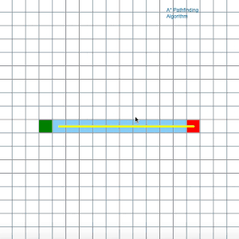
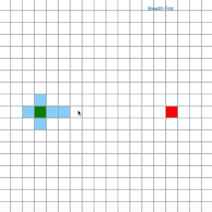

# MoMath Hackathon 2017: Interactive Search Visualization

- Project category: Math Square Behavior
- Sadman Fahmid and Dhruv Kathuria

 
 

## The Math

Finding the shortest path between two points is an extremely common and wildly applicable problem. Be it determining the shortest trip from your house to the mall, moving a video game character to safety, or even finding the shortest path to lay cables between houses in a city, a systematic approach to finding this shortest path is clearly very useful to our day to day lives. 

Our visualization aims to show how such a systematic approach to finding the shortest path might look as it runs, giving the viewer direct insight into not only how various algorithms behind finding the shortest path might run 'under the hood' but also how these algorithms will perform different based on the situation. We demonstrate the 'A star' search algorithm and a 'Breadth-first' search algorithm. The 'A star' algorithm solves the shortest path problem by finding the closest 'steps' and from those, choosing one that appears most likely to be the correct solution. Conversely, the 'Breadth-first' search algorithm looks at all possible neighboring 'steps' and continues radially outward until the solution is found. 

## The Submission

Our submission focuses on demonstrating how the two aforementioned search algorithms work. We do so by having the user provide various 'walls' on the board thus placing boundaries on where the path might travel. After a pre allotted amount of time, the computer then renders its solution for the shortest path between the pre-given start and end points. As the computer solves this problem, the 'visited' squares are highlighted, demonstrating how each algorithm 'searches'. For example, given no walls on the board, the A star algorithm makes a line right from the start to the finish. The breadth first algorithm on the other hand spreads out in all four directions until the end point is finally met. Both render the same shortest path of a direct line from start to finish. 

We aim to make 3 mathematical points:
  - Different algorithms can be used to solve the same problem
  - Different starting positions can influence which algorithm is the best for the situation
  - Regardless of efficiency, the mark of a true algorithm is a guaranteed solution, assuming the solution exists
  
The user is engaged by providing the 'walls' that influence the algorithms' output. The use thus plays an active role in influencing the visualization and allows the user to realize for themselves the three goals by playing around with the starting parameters for the search. We envision this visualization being targeted to all ages. Younger children will enjoy being able to make boundaries and watch the algorithm find a path, assuming it exists, regardless of the boundaries placed. Older children and adults will appreciate the systematic nature of the algorithms and will appreciate watching the computer actually go about solving the problem.

## Additional Notes

The code as it stands also provides easy addition of other algorithms such as Dijkstra's algorithm - arguably the most famous solution to solving the shortest path problem. 

The largest issue was in rendering the individual stages of the algorithm. The algorithms are designed to be run once and output the solution of the shortest path. Visualizing the algorithm in accordance with the board rendering paradigm forced us to take a two pronged approach of using counters/queues and a virtual matrix to determine the intermediate steps of the algorithms and output the visualization of these intermediary positions. 


## Running

### Requirements

* [node+npm](https://nodejs.org/en/download/)

### Installation
Download or clone this repository locally.
On the command line, navigate to the downloaded math-square folder and run
```
npm install
npm run-script dev
```

An Electron browser window should open up. Enter "search" into the navigation bar and tick the "mouse" checkbox to the right of it. You may click on individual squares to create obstacles for the pathfinder.
